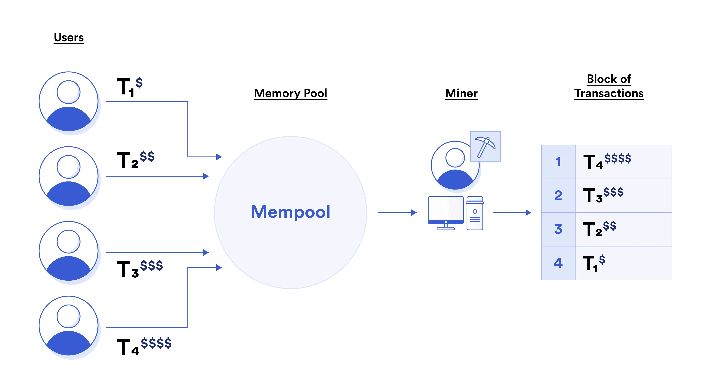
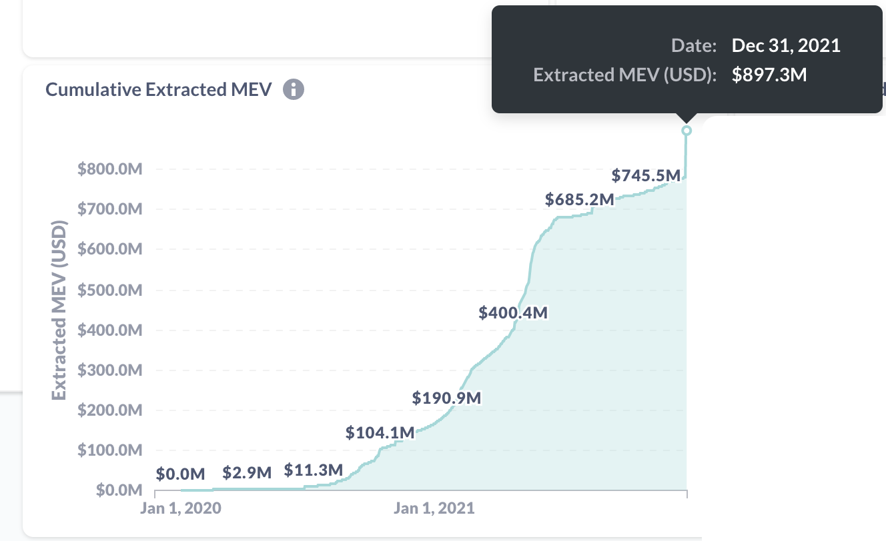
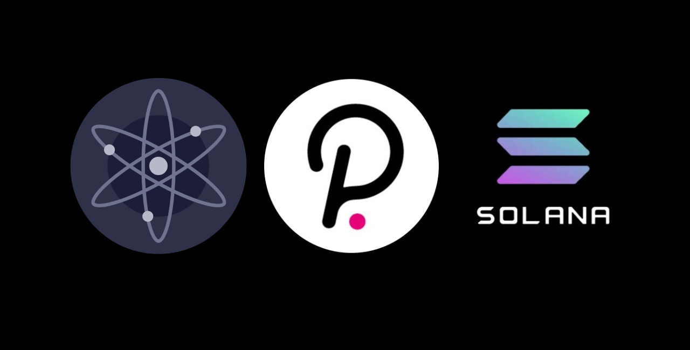

After weeks of unsuccessful attempts at a mev-geth port to ethermint, we instead put some of our learnings into this informative blog post for anyone to understand MEV, with a special focus on MEV w/ PoS. Will also be added to https://www.onlyalt.com/blog :)

# MEV: Miner extractable value

One of the most fascinating areas of research in blockchain technology right now is MEV aka Miner (or Maximum) extractable value. At its core, MEV refers to extra value that can be accrued by those that secure a network (miners & validators), beyond what is already rewarded to them through rewards or gas fees.

Traditional transaction ordering on Ethereum. via Chainlink

When a miner/validator is working to group up transactions into blocks, there's usually quite a lot of freedom left to them to decide which transactions to include. The vast majority of the time, they will choose the most profitable (highest gas price) transactions first and then continue down as expected. However that freedom also allows them to take "bribes" in exchange for ordering transactions a certain way or including specific transactions. Therefore, if the bribe amount in a transaction is greater than the expected gas price of another regular transaction, an optimized miner/validator will choose to take the bribe.

## **Who pays these bribes, and why?**

Most of the exploitation of MEV (97%) is currently done by bots looking to "frontrun" retail traders attempting to trade fungible tokens on decentralized exchanges like [Uniswap](https://uniswap.org/) & [Sushiswap](https://sushi.com/). Because these exchanges rely on algorithms to price tokens, large buys can swing the price of the token up and vice versa.
**So, all a bot has to do is:**

1. Wait for a large transaction to land in the public mempool, lets say to BUY 10,000 of token A while the price is $1.

2. Calculate how much the price of token A would increase on that BUY to check if frontrunning is profitable.

3. Send a transaction bundle that includes 4 transactions through a hidden pathway. (often mev-relay)

a. The bot's transaction to **BUY** 10,000 of token A at $1. (Which causes the price to increase, lets say to $1.10)

b. The retail trader's transaction to **BUY** 10,000 of token A at $1.10. (Which causes the price to further increase to $1.20)

c. The bot's second transaction to **SELL** 10,000 of token A at $1.20.

d. The bot's third transaction to **PAY** a bribe to the miner/validator (Of lets say $1000)

In 2021 these bots made a total profit of over $750,000,000 USD on Ethereum. via MEV Explore

These transaction bundles are then checked by miners/validators to make sure all transactions will succeed and then added to the next block in the requested order. This puts the bot's downside risk at $0 (if the transaction bundle is never accepted) and if accepted nets a $1000 profit for the bot and $1000 for the miner/validator taken from retail traders. Because of the harm to retail traders, the overall increase in gas prices due to these additional transactions and the addition of hidden pathways in what should be a open & decentralized blockchain, MEV is generally viewed as a net negative for a blockchain.

## Flashbots

In an effort to make MEV more transparent and available to anyone (but NOT reducing/preventing MEV), an organization known as [Flashbots](https://github.com/flashbots/pm) released the first version of custom tooling for miners (mev-geth and mev-relay) in March of this year. Their sealed-bid auction model allows anyone to submit a transaction with a bribe, reducing stress on the Ethereum network and reducing the amount of collusion required by miners to maximize MEV.

Flashbots Searchers (bots/bribers) send transactions directly to miners through mev-relay, bypassing the mempool

## MEV with Proof of Stake (PoS)

While few blockchains have enough economic activity to allow for much MEV, its reduction is still top of mind for networks like Polygon, Solana, Polkadot, Cosmos/Evmos and more. Validators, just like miners on Proof of Work (PoW) chains, propose blocks and are able to reorder them before submission. Additionally, because most of these networks have extremely low transaction fees, a frontrunning bot (even without a bribe) can easily spam the network with transactions, hoping that one of the transactions lands in the correct spot, right before one from a retail trader.

Cosmos, Polkadot and Solana are three popular PoS L1 chains

**Approaches and possible workarounds to MEV reduction on PoS chains:**

**Solana** - 400ms between blocks leaves minimal time for validators to check every waiting transaction to determine the most profitable. More powerful proposers would still be able to optimize transaction ordering.

**Polkadot** - Randomized transaction ordering by a future block proposer. The future block proposer is predetermined and can still take bribes to reorder previous blocks if they have enough computing power to break the randomization. Or multiple validators can collude.

**Evmos/Cosmos** - Prioritized mempool similar to Flashbots to make MEV more transparent. RED TEXT: Still increases costs for retail traders that don't want to be frontrun. With a high enough bribe off-chain (big enough frontrunning opportunity), would still be worth it to reorder transactions differently.

**All PoS chains** - Rewards are split among ALL validators on PoS chains, a specific block proposer is less incentivized to maximize MEV. Penalties (Slashing) are given to validators for “malicious behavior”, often not worth risking a validators stake of tokens. Proposers can accept bribe payment off-chain, wouldn't need to share with the rest of the network OR their stakers. Large enough opportunity could be worth bearing the slashing.

## MEV in **Evmos/EVM-compatible chains**

While it isn’t possible to directly port all of the Flashbots tooling (mev-geth, mev-relay) over to Evmos, it’s become clear that some form of MEV will exist on EVM compatible PoS chains like Evmos and ETH2. Evmos will likely eventually update to Tendermint v0.35 within Ethermint which supports the prioritized mempool referenced above that you can read more about [here](https://medium.com/tendermint/tendermint-v0-35-introduces-prioritized-mempool-a-makeover-to-the-peer-to-peer-network-more-61eea6ec572d). This would allow built in transaction re-ordering based on a “priority” value that block proposers would be incentivized to follow via a fee structure. While it seems this might eventually lead to “gas wars” similar to Ethereum, it is unlikely because of Ethermint’s capability to support 200 transactions per second ( over 15times more than ETH ).

In preparation for ETH2, Flashbots also launched a [fresh repo](https://github.com/flashbots/mev-boost) this month that attempts to adapt the Flashbots sealed-bid auction model to PoS. The core changes outsource the block construction to any number of builders, leaving the block proposer to simply optimize for maximum reward. The advantage here is that even if the block times get very short, there are third parties hunting for the optimal transaction ordering rather than just the single validator, rewarding both parties.

mev-boost planned architecture for outsourcing of block proposals in PoS 

## Conclusion

In many ways, the ability for miners/validators to see upcoming transactions and act on them is similar to high frequency trading firms purchasing access to order flow from brokerages like Robinhood & ETrade. However, the guarantees on transaction ordering with MEV bribes make frontrunning far more dangerous on blockchains. (And far more interesting to watch & study!)

As Evmos launches and grows, I'm excited to see how well the prioritized mempool and other enhancements work to reduce the effect of MEV on retail traders. While retail traders may not notice the small changes in expected and executed price on trades, the $750 million in extracted value this year proves it's a big business.

*😊 Thanks for reading, hope you found the topic as interesting as I do!*

*And join us in the Evmos community! → [https://discord.gg/8Xd29MU4DE](https://discord.gg/8Xd29MU4DE)*
